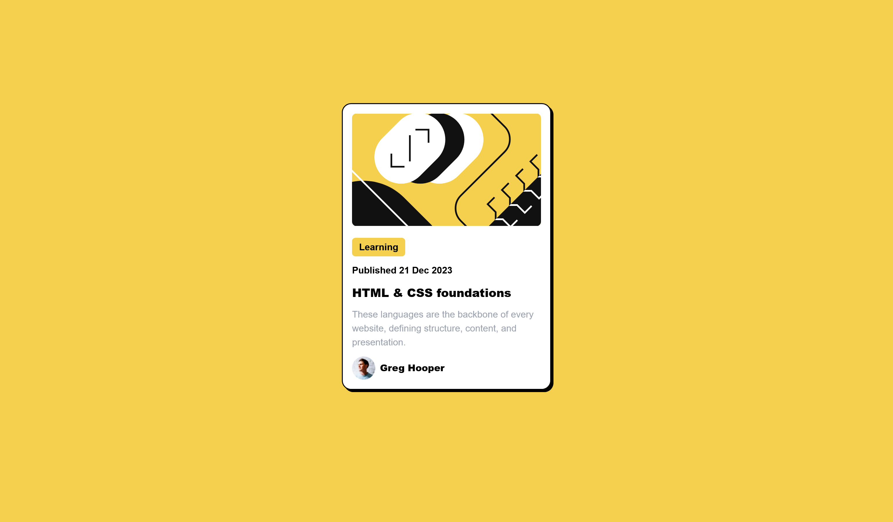
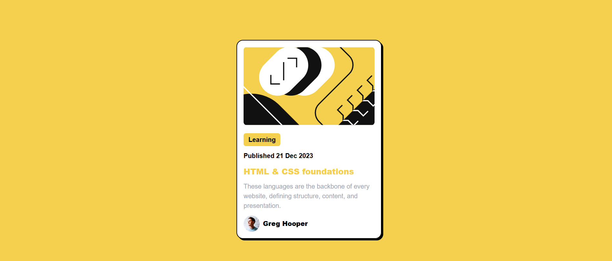
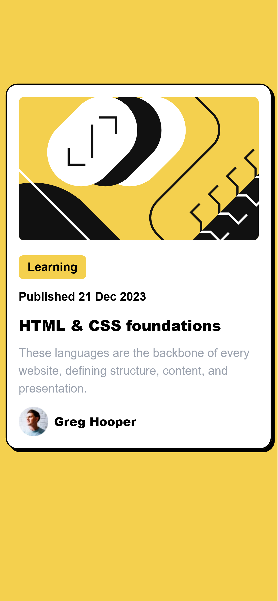

# Frontend Mentor - Blog preview card solution

This is a solution to the [Blog preview card challenge on Frontend Mentor](https://www.frontendmentor.io/challenges/blog-preview-card-ckPaj01IcS). Frontend Mentor challenges help you improve your coding skills by building realistic projects.

## Table of contents 💻

- [Overview](#overview)
  - [The challenge](#the-challenge)
  - [Screenshot](#screenshot)
  - [Links](#links)
- [My process](#my-process)
  - [Built with](#built-with)
  - [Useful resources](#useful-resources)
- [Author](#author)
- [Acknowledgments](#acknowledgments)

## Overview

### The challenge ⚠️⚠️⚠️

Users should be able to:

- See hover and focus states for all interactive elements on the page

### Screenshot 📷🖼️

- Desktop version.
  
  

- Mobile version.
  

### Links 🔗

- Solution URL: [Source code on Github](https://github.com/Abaljerind/blog-preview-card-main)
- Live Site URL: [Ping Coming Soon Page Component](https://blog-preview-card-main-qksijewzq-abaljerind.vercel.app/)

## My process 🛠️

### Built with 🏗️

- Semantic HTML5 markup
- [React JS](https://react.dev/) - JS Library
- [TailwindCSS](https://tailwindcss.com/) - For styles
- Flexbox

### Useful resources ⛵

- [TailwindCSS](https://tailwindcss.com/) - This help me to do the styling more easy. I really liked this tailwind css and will use it going forward.
- [Vercel](https://vercel.com) - This is an amazing website which helped me to upload my website into the internet. I'd recommend it to anyone still learning to use this website.
- [React JS](https://react.dev/) - This library help me to create this website easier, although I'm still new to learn it, I really like it.

## Author ✨😎✨

- Website - [AbalJerind](https://blog-preview-card-main-qksijewzq-abaljerind.vercel.app/)
- Frontend Mentor - [@Abaljerind](https://www.frontendmentor.io/profile/Abaljerind)

## Acknowledgments 😊

I want to thank me for believing in me, I want to thank me for doing all this hard work. I wanna thank me for having no days off. I wanna thank me for never quitting. I wanna thank me for being me at all times.
